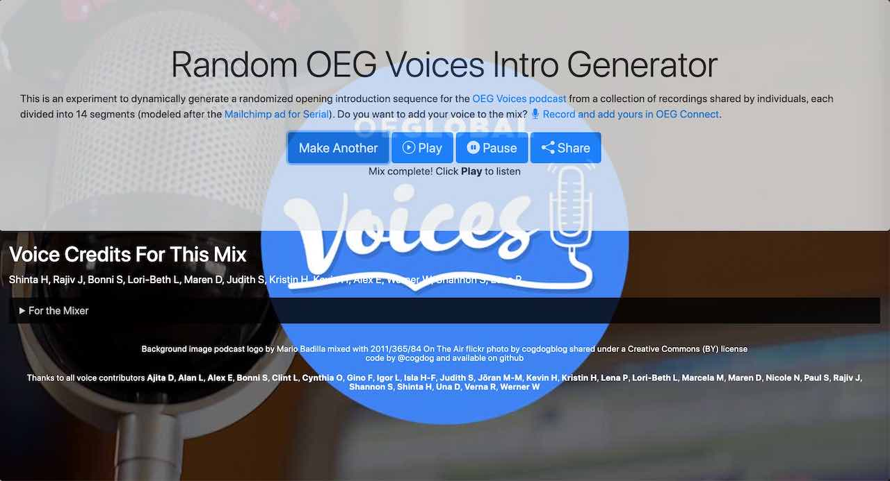
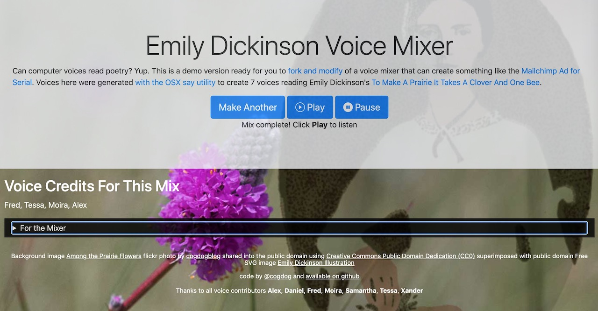
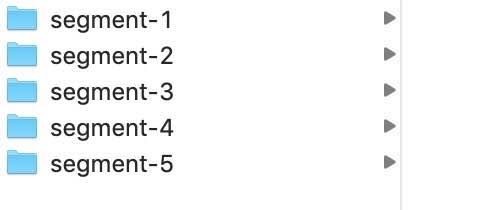
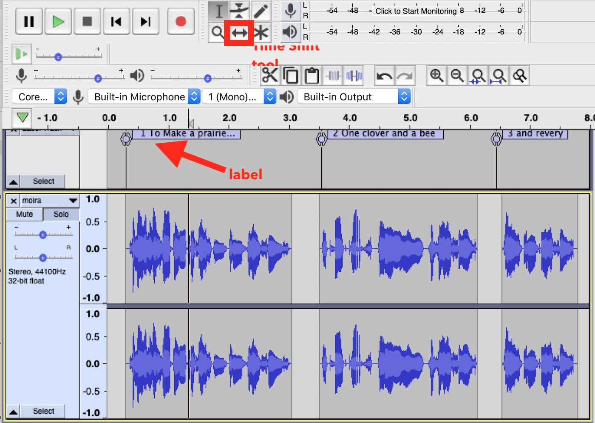
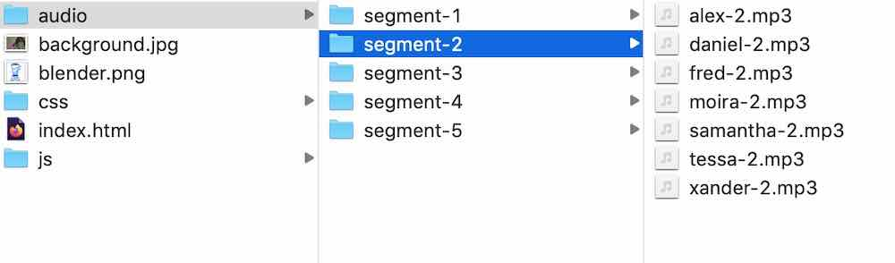

# Voice Mixer

SPLOTish tool for creating mixes of different voices reading the same original text, in the style of the [Mailchimp Ad for Serial](https://qz.com/298094/how-mailchimps-irresistible-serial-ad-became-the-years-biggest-marketing-win/).

-----
*If this kind of stuff has any value to you, please consider supporting me so I can do more!*

[](https://patreon.com/cogdog) [](https://paypal.me/cogdog)

----- 

## Why?
I was always fascinated by the audio method used in the [Mailchimp ad](https://soundcloud.com/mollyfitzpatrick-2/mailchimp-promo-on-serial) that was part of the original Seriel Podcast. If I ever had a chance to teach audio editing and storylling again, I would make this an assignment!

But I finally put it to use when I started producing a podcast for Open Education Global http://voices.oeglobal.org -- in the first iteration, I got my colleagues to read the introduction text I wrote and I manually edited it together [as a one off clip](https://podcast.oeglobal.org/wp-content/uploads/2020/08/oeg-voices-intro-v2.mp3).

But I had bigger dreams...

## What?

I wanted to set up a means by which I could ask anyone interested to record the two paragraphs of text so I could have a bigger pool of audio clips. Several came in after [a posted a call for voices in our community site](https://connect.oeglobal.org/t/contribute-your-voice-to-oeg-voices-opening-segment/3213). And I also asked podcast guests a the end of a recording if they were willing to read the text. 

But the thing I wanted was a web site where anyone (or just me( could generate a random mix version, and ideally some way that I could then use it to mix the audio.

I made [a first version specific for my own podcast series](https://cogdog.github.io/mixvoices/) and it has been working great. It goes through some magic to assemble the 14 clips that make up the piece, randomizing the voice, and be able to play it back. It just plays them in sequence using some code I found for playing a list of mp3 audio as with HTML5 audio stuff.

[](https://cogdog.github.io/mixvoices/)

I have yet to figure out a way with client side Javascript, to string together the separate mp3 audio clips into a new mp3. But I did find that I could run a command line `ffmpeg` call to concatenate the source files, doing it from a text file that listed the source audio.

So this data is available under the toggle labeled "For the Mixer"

That did not help anyone else who might want to share a mix, but now there is a new feature that lets anyone who uses the tool to share that link.

Still, it is a tool built for me. Mine is a special case, since I copied Mailchimp by repeating the second segment 3 times (that reads "OEG Voices"), so the source code is wired specifically for my use.
But I wanted to have a version better suited for someone else to be able to do this without the special repeat case.

## Here is the Generalized Version

Here it is, and as a demo, I used the [OS X voice generation "say" tool](https://infoheap.com/convert-text-to-speech-on-mac-using-utility-say/) to have seven computer voices read the lines of Emily Dickinson's [To Make A Prairie It Takes A Clover And One Bee](http://www.public-domain-poetry.com/emily-elizabeth-dickinson/to-make-a-prairie-it-takes-a-clover-and-one-bee-13879).

Give it a spin at https://cogdog.github.io/voicemixer/

[](https://cogdog.github.io/voicemixer/)


The site lets you generate random mixes. If there is one worth saving, it offers a downloadble configuration file which can be run command line (I hear the room emptying) to stitch them together into a single mp3. But much easier, it any person creates a world famous mix of this powem it can be shared as a link, [try an example](https://cogdog.github.io/voicemixer/?playlist=YWxleCx0ZXNzYSx0ZXNzYSxtb2lyYSxkYW5pZWw=). For anyone with the source audio, this can generate the script file needed to make a stand alone audio.

That is silly yes, and I wanted to make it so others could build their own sites, with a different source, and different audio.

Yes @dogtrax I am finally making some documentation.

## Documentation Commences.

So first you need to fork this repo. That one is on you (or you can download the source and modify it as a standalone web site. It is all HTML/CSS/JS.

### Defining the Audio Segments
There is no limit to how long an opus you want multiple voices to say, but generally shorter, like lines from a poem, or maybe 1-2 paragraphs is best. For this example, the poem is just sliced by lines in it, or 5 segments.


````
To make a prairie it takes a clover and one bee, --
    One clover, and a bee,
    And revery.
    The revery alone will do
    If bees are few.
````

How you chop is up to you. But list put the segments so you have mapped the text to the audio directories you will use/make:

1. To make a prairie it takes a clover and one bee
2. One clover, and a bee,
3. And revery.
4. The revery alone will do
5. If bees are few.

In the /audio subdirectory, you will need to create a subdirectory for each segment, named sequentially:

]

You will have to make more directories if you have more segments.


### Audio Slicing into Segments

If you ask your participants for audio recordings, you might end up with a variety of file types, etc. Define a unique file base name for each voice. 

How you edit them to extract clips is up to you, but for say 5 segments, if I got a recording from Mary, I will be naming them `mary-1.mp3`, `mary-2.mp3`, ....` mary-5.mp3`.

For my projects, I import the track into Audacity, and I have a label track set up spread put enough I can split the clips (**Edit** -> **Clip Boundaries** -> **Split** ) and slide them woth the Time Shift Tool to be near their labels (spacing them out makes it easier to select).


 
For each segment, select the audio to use, and then do **File** -> **Export** -> **Export Selected Audio** to save each segment according to the file name to identify the voice (e.g. `mary` or `juan`), the segment number, for the file name (e.g. `mary-2.mp3` or `juan-2.mp3`), and save in the approproate segment directory (`segment-2`).

It does not matter how you edit the audio, as long as you can split Mary or Juan's recording each into the same 5 segments.

### Alan's Whacky Directory Structure

There was a reason for what may be a convoluted file naming convention. I wanted to organize all clips for the same segment in the one folder, but also wanted each file to include the segment in case  mixed things up. 

I also wanted to allow for the possibility where maybe one voice only read say half the lines, or I had to skip one segment because Juan's dog barked in the middle of segment 1.

So the file structure ends up like this:



### Setting Up the Configuration File
Each mixer defines key parameters in the file `js/config.js`. 

First, all of the voices are defined in an array:

````
var people = [
	{"id" : "moira" , "name" : "Moira", "segments" : [1,2,3,4,5]}, 
	{"id" : "alex" , "name" : "Alex", "segments" : [1,2,3,4,5]}, 
	{"id" : "tessa" , "name" : "Tessa", "segments" : [1,2,3,4,5]}, 
	{"id" : "xander" , "name" : "Xander", "segments" : [1,2,3,4,5]}, 
	{"id" : "daniel" , "name" : "Daniel", "segments" : [1,2,3,4,5]}, 
	{"id" : "samantha" , "name" : "Samantha", "segments" : [1,2,3,4,5]}, 
	{"id" : "fred" , "name" : "Fred", "segments" : [1,2,3,4,5]}, 
	
];
````

* The value for `id` is the base name for all segments for that person.
* The value for `id` is how this person's name will be displayed on the web page (perhaps first name only or just "Anonymouse 1")
* The array for segments indicates which segments this person's voice is used. For this example, all voices recorded all segments, but let's say we got audio for Maria and she only read the first  line and the last (maybe the rest are garbled, or she skipped them. We could add an entry like

````
	{"id" : "maria" , "name" : "Maria", "segments" : [1,5]},
````` 
	 
Next is an array to list the text for each segment, used to display as a caption during playback:

````
var segment_text = [
	"To make a prairie it takes a clover and one bee",
	"One clover, and a bee",
	"And revery",
	"The revery alone will do",
	 "If bees are few"
]
````

Modify to match your audio.

Last we must define how many segments there are (for my OEG Voices on the value is 14).

     var numsegments = 5; 


Then, I select each sub clip, and Use File

### Customizing the Web Page

Swap in your own background image for `background.jpg` suggested size at least 1200px x 630px.

Also, if desired, create your own favicon to replace the blender one, 64x64px png saved as `shortcut-icon.png`

Next edit `index.html` to modify the screen text as follows below. All areas to edit are indicated in the source HTML with comments starting like: 	

`<!-- voicemixer edit: change the prompt -->`

The suggested edits include:

* title tag
* meta description (if you like nice google results)
* Meta Tags for preview display in social media (e.g. twitter cards, facebook) easily generated https://www.opengraph.xyz 
* the headline site title, e.g. **Emily Dickinson Voice Mixer**
* the description below the title, can be whatever HTML you like
* image attribution or whatever else you want in the footer

If you are brave enough to fork this repo, slice and dice audio, I hope some manual HTML editing is not too much!


### Github Page Publishing

If you are running your mixer from here (and I think it's the way to go) once you have made edits, uploaded your own audio, go to your repo's **Settings** then click **Pages** on the left. Under Source from the menu under **select  branch"" chose `main` then under Folder select `root`. Press Save and your mixer will be published onder your own github.io space. 

## Actual Examples

* OEG Voices Intro Mixer https://cogdog.github.io/mixvoices/ -- (used for [OEG Voices Podcast](http://voices.oeglobal.org))  
* Generador de introducción de voces aleatorias OEG https://cogdog.github.io/mixvoices/es/ --  (the same introduction but for [the episodes recorded in Spanish](https://podcast.oeglobal.org/shows/spanish/)) 
* CLMOOC Poem Voice Mixer https://dogtrax.github.io/voicewordpoem/ -- (Kevin Hodgson figured out how to do this before I  had any documentation, go @dogtrax!)


## History

* **Apr 9, 2022** Wow, actual documentation, woah.
* **Mar 22, 2022** bug fixes, move settings into separate config.js and addition of the Share button capability
* **Feb 5, 2022** first commit just to hang a demo.

